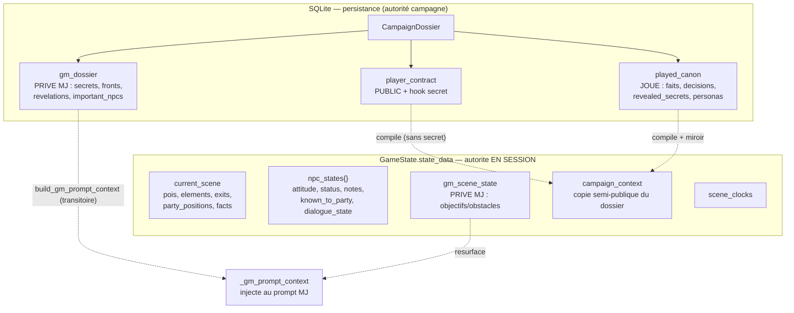
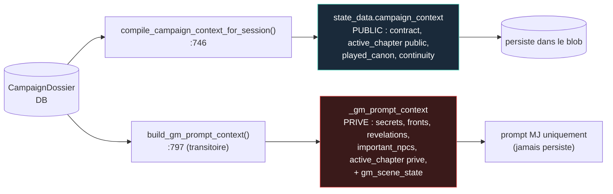
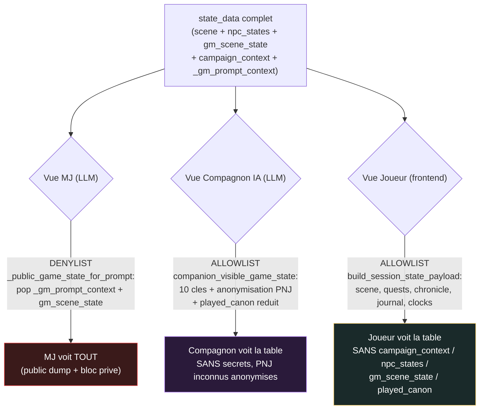
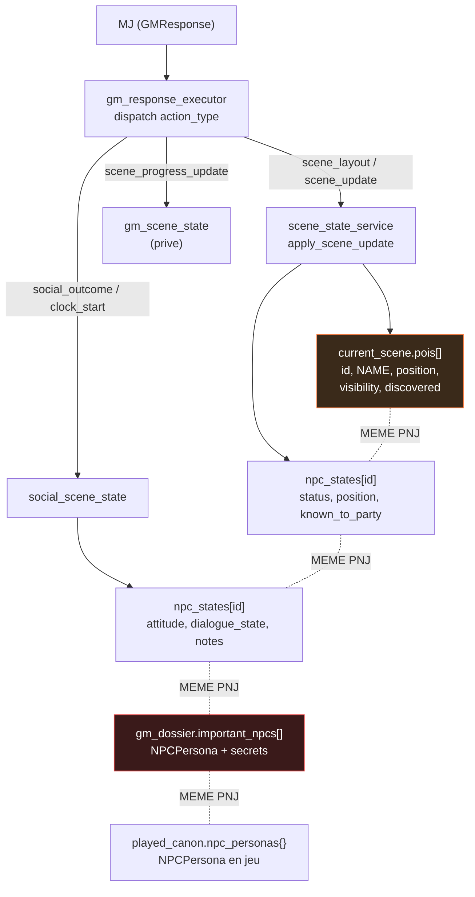
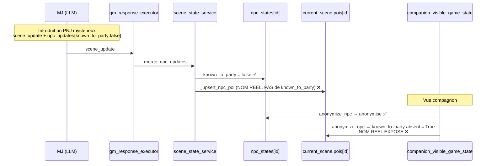
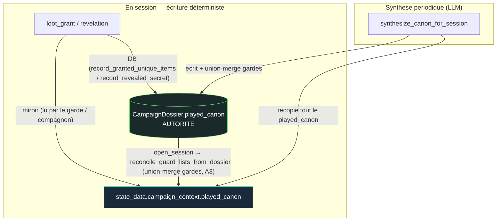

# Audit — Flux de données & fidélité « table » (axe Maître de Jeu)

> **Date** : 2026-05-31 · **Périmètre** : qui détient quoi, qui lit quoi, où vivent le canon, le joué, la scène, les secrets, le « connu », et l'état général. Lecture du code réel (`main`, HEAD `a8f2e06`).
> **Hors périmètre** : sécurité / perf / découpage god-files → déjà couverts par [`audit-architecture-2026-05.md`](audit-architecture-2026-05.md). Cet audit-ci est **complémentaire** : il porte sur l'**architecture de l'information**, pas sur le runtime. Suivi des correctifs de fidélité : [`suivi-tabletop-fidelity.md`](suivi-tabletop-fidelity.md).

---

## Contexte

Les lots `suivi-tabletop-fidelity.md` (1→12) ont durci, un par un, les frontières d'information (dossier privé MJ, anonymisation PNJ, scène source-de-vérité, secrets de chapitre, `gm_scene_state`). Le résultat est solide **mais empilé** : la même information (un PNJ, son nom, ce qu'on sait de lui) vit désormais dans **4 endroits**, et les frontières de visibilité reposent sur **deux mécaniques opposées** (allowlist côté joueur/compagnon, denylist côté MJ) qui ne partagent aucune source commune. Les « soucis persistants » ne viennent plus d'une frontière oubliée, mais de **désynchronisations entre copies** d'une même donnée.

Objectif de l'audit : mettre tout à plat, visualiser les flux, et cibler les **incohérences structurelles** (pas les bugs ponctuels).

---

## 1. Mise à plat — inventaire des données

### 1.1 `CampaignDossier` (table SQLite — la « bible », autorité de campagne)

`backend/app/models/campaign_dossier.py:28-37`

| Colonne JSON | Visibilité | Contenu |
|---|---|---|
| `player_contract` | **Public** (sauf `hook`) | `title`, `known_objectives`, `visible_chapters`, `played_summary` — **`hook` = twist secret, jamais affiché** |
| `gm_dossier` | **Privé MJ** | `narrative_arc`, `secrets`, `revelations`, `fronts`, `factions`, `important_npcs[]` (NPCPersona **complètes, avec `secrets` + `motivations.hidden`**), `locations`, `items`, `custom_monsters`, `quests`, `complications`, `clues`, `light_mechanics` |
| `played_canon` | **Mixte** | `established_facts`, `player_decisions`, `revealed_secrets`, `npc_relationships`, `plan_changes`, `rolling_summary`, `chapter_progression`, `npc_personas{}` (générées en jeu), `granted_unique_items` |
| `import_sources`, `forge_job`, `active_chapter_id`, `generation_status` | interne | pipeline de forge |

`empty_played_canon()` : `campaign_dossier_service.py:61-73`.

### 1.2 `GameState.state_data` (blob JSON — l'état de session vivant)

Autorité **en session** (`ActiveSession.state_data`), réécrit en entier à chaque save. Schéma `state_schema.py` quasi advisory (`extra="allow"`).

| Clé | Visibilité | Écrit par |
|---|---|---|
| `phase`, `characters{}`, `combatants{}`, `turn_manager`, `pending_encounter` | public | pipeline combat / loop |
| `current_scene` | public | `scene_state_service.apply_scene_update` + `scene_layout` |
| `npc_states{}` | **mixte** | `social_scene_state.py`, `scene_state_service._merge_npc_updates`, `action_resolver` |
| `gm_scene_state{}` | **Privé MJ** | `gm_response_executor._apply_scene_progress_update` (Lot 9) |
| `scene_clocks[]` | public | `social_scene_state.py` |
| `campaign_context` | **semi-public** (copie compilée du dossier) | `compile_campaign_context_for_session` |
| `_gm_prompt_context` | **Privé MJ, transitoire** | injecté à la construction de prompt, non persisté |
| `adventure_journal`, `quests[]`, `chronicle[]`, `grid_*`, `encounter_monsters` | public | divers |

### 1.3 Les trois objets « contexte » — le point de confusion central

C'est ici que se joue 80 % de la complexité. **Trois** objets se ressemblent et se chevauchent :

1. **`campaign_context`** (`compile_campaign_context_for_session`, `campaign_dossier_service.py:746-794`)
   → stocké **dans `state_data`**, semi-public. Contient `player_contract`, `active_chapter` **(version publique)**, `played_canon`, `continuity`, `known_quests`, `items`. **Aucun secret.** Reset à vide sur la 1ʳᵉ session (`:760-762`).

2. **`_gm_prompt_context`** (`build_gm_prompt_context`, `campaign_dossier_service.py:797-858`)
   → **transitoire**, injecté **uniquement** dans les prompts MJ. Contient `global_secrets`, `revelations`, `fronts`, `factions`, `important_npcs` (complètes), `active_chapter` **(version privée)**, `played_canon` (sous-ensemble), **+ `gm_scene_state`**. Requiert `generation_status == "validated"`.

3. **`gm_scene_state`** → mémoire privée MJ de progression de scène, vit dans `state_data`, **resurfacée** au MJ via le `_gm_prompt_context`.

> **Observation clé** : `campaign_context.played_canon` et `_gm_prompt_context.played_canon` et `CampaignDossier.played_canon` sont **trois vues du même canon joué**, compilées à des moments différents. Le canon est donc présent en DB (autorité) **et** miroité dans le blob (lecture runtime + visibilité compagnon).

### 1.4 NPCPersona — porteuse des secrets

`backend/app/agents/persona.py` : `NPCPersona` expose `secrets[]` (GM-only, `:108`), `quest_hooks[]` (`:109`), et `motivations.hidden[]` (`:53`). Ces champs **ne doivent jamais** franchir une frontière joueur/compagnon. Macro `_persona_render.j2` : `include_hidden=True` côté MJ, `False` côté compagnon.

---

## 2. Diagrammes des flux

### 2.1 Carte de possession — où vit chaque donnée



### 2.2 Compilation des contextes — dossier → runtime



### 2.3 Frontières de visibilité — qui voit quoi (le cœur de la fidélité)



> **Asymétrie de mécanique** : MJ = **denylist** (`gm_agent.py:35-42`), Compagnon = **allowlist** (`companion_visibility.py:16-27`), Joueur = **allowlist** (`ws_payloads.py:61-76`). Les trois ne partagent aucune définition commune de « ce qui est secret » → toute nouvelle clé privée doit être pensée 3 fois.

### 2.4 État de scène — fragmentation d'un même PNJ



> **Un seul PNJ = 4 représentations** (`pois`, `npc_states`, `important_npcs`, `npc_personas`). `name`, `position`, `known_to_party` y sont **dupliqués** sans source unique. C'est la racine structurelle des bugs de fidélité.

### 2.5 Flux « connu / secret » — où la désynchro se produit



### 2.6 Canon joué — double-écriture et réconciliation au reload

> **Correction 2026-05-31** : une version antérieure de ce diagramme indiquait que les écritures en session n'allaient que dans le miroir et étaient « perdues au reload ». **Faux** — vérifié dans le code : les listes-gardes (`granted_unique_items`, `revealed_secrets`) sont **doublement écrites** (miroir + DB) au moment de l'action. Le seul vrai risque résiduel était le **reload d'un blob périmé** (si `save_state` est en retard sur le commit DB lors d'un crash) → corrigé par A3.



**Autorité par champ (vérifiée)** :

| Champ | Écriture en session | Lecture en jeu | Reload |
|---|---|---|---|
| `granted_unique_items` | miroir **+ DB** | miroir (garde loot) | réconcilié DB→miroir (A3) |
| `revealed_secrets` | miroir **+ DB** (A5) | miroir (compagnon) + DB (MJ) | réconcilié DB→miroir (A3) |
| `npc_personas` | **DB seule** (`upsert_npc_persona`) | **DB** (`get_npc_persona`) | cohérent (jamais via miroir) |
| `established_facts` / `player_decisions` / `rolling_summary` | synthèse → DB, recopie miroir | miroir (compagnon) | recompilé / auto-réparé à la synthèse |

---

## 3. Analyse de cohérence — les soucis persistants

> Sévérité : 🔴 fuite/perte de donnée réelle · 🟠 dette structurelle qui régénère des bugs · 🟡 hygiène.

### 3.1 🔴 Fuite d'anonymisation PNJ via les POI de scène — **confirmée dans le code**

**Chaîne** : `known_to_party` n'est posé sur un POI qu'à **deux endroits** : ouverture (`routes_game.py:1076`, =False) et engagement joueur (`action_resolver.py:216-218`, =True). En revanche :
- `scene_state_service._merge_npc_updates` (`:220-221`) pose `known_to_party` **uniquement sur `npc_states[id]`**, jamais sur le POI ;
- `_upsert_npc_poi` (`:233-258`) crée le POI **sans** `known_to_party` ;
- `_normalize_poi_patch` (`_POI_TEXT_FIELDS`, `:20-30`) **ne liste pas** `known_to_party` → même si le MJ le passe dans `upsert_pois`, il est **silencieusement supprimé**.

**Conséquence** : tout PNJ introduit **en cours de scène** (via `scene_update`) a son `npc_states` correctement marqué inconnu (→ anonymisé pour le compagnon), **mais son POI garde le nom réel**. `anonymize_npc` traite l'absence de `known_to_party` comme `True` (`companion_visibility.py:106`) → **le compagnon IA voit le vrai nom** via `current_scene.pois`. Le travail d'anonymisation du lot « Wiggly Moore » est court-circuité pour tous les PNJ non issus de l'ouverture.

**Statut** : ✅ corrigé (A1 + A1bis, 2026-05-31).

### 3.2 🟠 Double-stockage du canon joué — miroir vs DB *(re-vérifié, corrigé A3)*

> **Re-vérification 2026-05-31** : l'analyse initiale (« écrit seulement le miroir, perdu au reload, `record_granted_unique_items` non emprunté ») était **fausse**. Le code (`gm_response_executor.py:1468-1475`) écrit **les deux** : miroir (`_mark_unique_items_in_state`) **et** DB (`record_granted_unique_items`). A5 a rendu `revealed_secrets` dual de la même façon. Voir la table d'autorité §2.6.

Le canon joué vit en deux endroits : la **DB** (`CampaignDossier.played_canon`, autorité) et un **miroir** dans le blob (`state_data.campaign_context.played_canon`, lu en jeu par les gardes et le filtre compagnon). En jeu vivant le miroir ne peut pas diverger : chaque écriture déterministe est dual, et la synthèse recopie tout le `played_canon` DB→miroir.

**Le seul vrai risque** était le **reload d'un blob périmé** : `record_granted_unique_items` commit la DB immédiatement, mais `save_state` (qui persiste le miroir) peut être en retard lors d'un crash. Au reload, `open_session` restaurait alors un miroir sans l'objet → la garde loot (`_granted_unique_items`, qui lit le miroir) pouvait **re-donner un objet unique** (fail-unsafe, visible joueur). `revealed_secrets` périmé est au contraire fail-safe (le compagnon en sait juste moins, auto-réparé à la synthèse suivante).

**Statut** : ✅ corrigé (A3, 2026-05-31) — `SessionManager._reconcile_guard_lists_from_dossier` union-merge les listes-gardes DB→miroir à `open_session`. Union uniquement (jamais de vidage, jamais les champs de synthèse), no-op sans dossier+contexte → sûr en session 1, n'appelle jamais `compile`.

### 3.3 🟠 Identité PNJ éclatée sur 4 représentations

Cf. diagramme 2.4. Aucune entité « PNJ » unique : `name`/`position`/`known_to_party` dupliqués entre `pois`, `npc_states`, `important_npcs`, `npc_personas`. Chaque écriture doit penser à mettre à jour les autres copies — ce qui n'arrive jamais complètement (3.1 en est le symptôme direct). C'est la **cause-racine** ; 3.1 est une de ses manifestations.

**Statut** : ✅ corrigé pour `npc_states ↔ pois` (A4, 2026-05-31) — `npc_states[id]` est l'autorité d'identité, le POI est une **projection** réconciliée à chaque écriture de scène. Reste hors périmètre A4 : la liaison `important_npcs`/`npc_personas` (persona) à `npc_states`, traitée par `_resolve_npc_persona_or_hint` à la demande.

### 3.4 🟠 « Secret révélé » non événementiel

Le dispatch de `gm_response_executor` (`:417-463`) gère 21 `action_type`, mais **aucun** n'enregistre une révélation de secret au moment où elle a lieu. `played_canon.revealed_secrets` est peuplé **a posteriori** par la **synthèse LLM** (`campaign_synthesize_canon.txt`). Donc : la trace « ce secret est désormais connu » est **inférée**, peut **retarder** (jusqu'à la prochaine synthèse) ou **halluciner**. Le compagnon reçoit `revealed_secrets`, le joueur non (pas dans l'allowlist `ws_payloads`) → asymétrie : l'IA dispose d'une liste structurée que l'humain n'a pas.

**Statut** : ✅ corrigé (A5, 2026-05-31) — action `revelation` déterministe + protection de la synthèse (union-merge). Surfaçage joueur non fait (décision produit séparée).

### 3.5 🟡 Trois mécaniques de frontière sans définition commune

MJ = denylist, compagnon/joueur = allowlist (cf. 2.3). Robuste aujourd'hui, mais **aucun invariant partagé** : l'ajout futur d'une clé privée dans `state_data` exige de la traiter à 3 endroits. Aucun test ne garantit qu'un champ secret (`gm_dossier.secrets`, `motivations.hidden`, `hook`, `gm_scene_state`, `_gm_prompt_context`) est absent **simultanément** des deux vues publiques.

**Statut** : ✅ test d'invariant ajouté (A2, 2026-05-31).

### 3.6 🟡 Asymétrie de reset du canon sur la 1ʳᵉ session

`compile_campaign_context_for_session` remet le canon à vide pour la session initiale (`:760-762`) ; `build_gm_prompt_context` **non** → en session 1, le MJ peut voir un `played_canon` semé par la forge alors que la vue publique est vide. Bénin mais incohérent.

**Statut** : ✅ corrigé (A6, 2026-05-31) — `build_gm_prompt_context` applique le même reset `_is_initial_campaign_session`.

---

## 4. Actions proposées (priorisées)

### Priorité 1 — Stopper la fuite (🔴, ciblé, peu risqué) — ✅ FAIT
- **A1.** Faire de `npc_states[id].known_to_party` la **source unique**, et **dériver** l'anonymisation du POI à la lecture. Dans `companion_visible_game_state`, anonymiser un POI `kind=="npc"` en croisant `npc_states[poi.id].known_to_party` (et non `poi.known_to_party`). → supprime la classe entière de désync POI↔npc_state.
- **A1bis (filet).** Propager `known_to_party` dans `_upsert_npc_poi` et `_normalize_poi_patch` (`scene_state_service.py`) pour cohérence d'écriture.
- **Test** : un PNJ introduit via `scene_update{known_to_party:false}` est anonymisé dans `current_scene.pois` **et** `npc_states` côté compagnon.

### Priorité 2 — Invariant de frontière (🟡→🔴 en prévention) — ✅ FAIT
- **A2.** Test d'invariant : aucun champ secret (`_gm_prompt_context`, `gm_scene_state`, `secrets`, `motivations.hidden`, `hook`, `quest_hooks`) dans `companion_visible_game_state()` **ni** `build_session_state_payload()`. Toute régression future est attrapée par un test unique.

### Priorité 3 — Canon joué à écriture disciplinée (🟠) — ✅ FAIT
- **A3.** Re-vérification : la double-écriture (miroir + DB) existait **déjà** pour `granted_unique_items` et `revealed_secrets` (A5). Le résidu réel = reload d'un blob périmé → garde loot fail-unsafe (re-don d'objet unique). Corrigé par `SessionManager._reconcile_guard_lists_from_dossier` : **union-merge** des listes-gardes DB→miroir à `open_session`. Strictement borné (2 listes append-only, union uniquement, jamais les champs de synthèse, no-op sans dossier) — l'option « recompiler au reload » a été **écartée** car `compile_campaign_context_for_session` applique le reset session-initiale qui **viderait** un canon de mi-session-1 déjà commité en DB. Autorité par champ documentée en §2.6.
- **Tests** : `tests/test_game/test_guard_list_reconcile.py` (prouvé : échoue sans le fix, passe avec — pas de re-don après reload périmé).

### Priorité 4 — Unifier l'identité PNJ (🟠, structurel) — ✅ FAIT
- **A4.** `npc_states[id]` devient l'**autorité d'identité** du PNJ. `current_scene.pois` reste la **projection visible** (le payload joueur sérialise `current_scene` brut → on ne peut pas vider `name` du POI sans casser la vue humaine). Une fonction unique `reconcile_scene_npcs(active, scene)` (`scene_state_service.py`) projette `known_to_party` (npc_states gagne) et `name` (npc_states gagne si défini, sinon le POI amorce) sur le POI **après chaque écriture de scène** — branchée dans `apply_scene_update` et `_apply_scene_layout`. Les writers ne touchent plus que `npc_states` ; le POI suit. Réduit la désync `pois ↔ npc_states` à zéro et rend A1bis structurel.
- **Tests** : `tests/test_game/test_npc_identity_reconcile.py` (contrat de résolution + bout-en-bout).

### Priorité 5 — Révélation événementielle (🟡) — ✅ FAIT
- **A5.** Action `revelation` dans `gm_response_executor._apply_revelation` : append déterministe à `played_canon.revealed_secrets` **au moment** de la révélation, en **double écriture** (miroir `campaign_context` lu par le compagnon + DB `record_revealed_secret` lu par le prompt MJ). **Protection critique** : `synthesize_canon` fait désormais un **union-merge** de `revealed_secrets` (comme `granted_unique_items`) pour que la passe LLM ne puisse pas effacer/reformuler un secret déjà révélé. Vocabulaire ajouté à `GMAction.type`, `gm_system.txt`, `gm_narrate.txt` (sinon action morte jamais émise). GM-only, aucun event publié. Surfaçage joueur = décision produit séparée, non faite.
- **Tests** : `test_gm_loot_actions.py` (handler + double écriture + idempotence), `test_campaign_dossier.py` (record + survie à la synthèse).

### Priorité 6 — Hygiène (🟡) — ✅ FAIT
- **A6.** `build_gm_prompt_context` applique le même `_is_initial_campaign_session` → `empty_played_canon()` que le compilateur public : sur la session initiale, le `played_canon` semé par la forge ne resurgit plus côté MJ. `gm_dossier` (secrets/arc/fronts/PNJ) intact → aucun contexte de planification perdu.
- **Test** : `test_campaign_dossier.py::test_gm_prompt_context_resets_canon_on_initial_session`.

---

## 5. Vérification

```bash
cd backend && source .venv/bin/activate
# Non-régression de base
.venv/bin/pytest tests -q
# Frontières d'information (A1/A2) + identité PNJ (A4)
.venv/bin/pytest tests/test_game/test_companion_visibility.py -v
.venv/bin/pytest tests/test_game/test_privacy_boundary.py -v
.venv/bin/pytest tests/test_game/test_npc_identity_reconcile.py -v
# Révélation événementielle (A5) + reset canon initial (A6)
.venv/bin/pytest tests/test_game/test_gm_loot_actions.py -v
.venv/bin/pytest tests/test_api/test_campaign_dossier.py -v
# Réconciliation des listes-gardes au reload (A3)
.venv/bin/pytest tests/test_game/test_guard_list_reconcile.py -v
```
- **A1** : test compagnon sur PNJ introduit en cours de scène (nom anonymisé dans `pois` ET `npc_states`).
- **A2** : test d'invariant unique (aucune clé secrète dans les deux vues publiques).
- **A3** : test reload après don d'objet unique sans synthèse → pas de re-don.
- Manuel : `npm run dev` + scène avec PNJ mystérieux introduit par le MJ → vérifier que le compagnon IA ne le nomme pas avant engagement.

---

## Annexe — fichiers pivots

| Rôle | Fichier:ligne |
|---|---|
| Bible campagne | `models/campaign_dossier.py:28` |
| Canon vide | `services/campaign_dossier_service.py:61` |
| Contexte public compilé | `services/campaign_dossier_service.py:746` |
| Contexte privé MJ | `services/campaign_dossier_service.py:797` |
| Vue compagnon (allowlist + anonymisation) | `game/companion_visibility.py:16,100,116` |
| Vue MJ (denylist) | `agents/gm_agent.py:35-42` |
| Vue joueur (allowlist) | `api/ws_payloads.py:61-76` |
| Fusion scène | `game/scene_state_service.py:43,185,233` |
| Progression scène privée | `game/gm_response_executor.py:748` |
| `known_to_party` (tous les sites) | `routes_game.py:1076`, `action_resolver.py:216-218`, `scene_state_service.py:220` |
| Persona + secrets | `agents/persona.py:49,103-110` |
