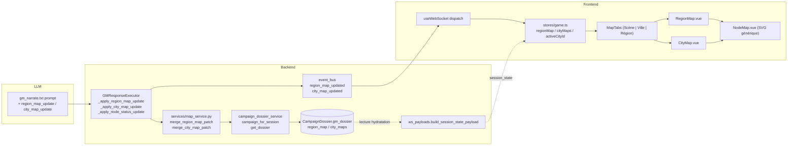

# Refonte du système de carte / plan

## Contexte

Le système de carte actuel se limite à un seul composant `Battlemap.vue` (1083 lignes) qui sert à la fois au combat tactique (grille hard-codée 10×8) et à l'exploration locale (scène = pièce/clairière unique avec POI, sorties, party_positions). Il n'existe **aucune** vue régionale, aucune carte de ville, aucune mémoire d'historique des lieux côté UI. `gm_dossier.locations[]` stocke pourtant des lieux côté backend (`CampaignDossier`) mais n'est jamais exposé au frontend.

Objectif : élever le système au rang de pièce maîtresse — onglets **Scène | Ville | Région**, cartes stylisées (nœuds + chemins, fond parchemin) construites incrémentalement par le MJ IA via patches, et combat tactique amélioré (drag&drop, AOE preview, pathfinding/ZOC, Dash/Disengage).

**Cadrage validé :**
- 4 axes (région, ville, combat amélioré, exploration enrichie), livrables en 3 phases indépendantes
- Style : nœuds stylisés (✓ visité / ◯ connu / ✦ actuel) sur fond parchemin SVG génératif — pas de génération d'image IA
- Génération MJ via actions structurées avec patches incrémentaux (pas remplacement total)
- Persistance **niveau campagne** (`CampaignDossier.gm_dossier`) — la géographie est partagée entre sessions d'une même campagne
- Aucun nouveau modèle SQLAlchemy

## Vue d'ensemble — 3 phases livrables

```
Phase 1 ─────────────────  Phase 2 ─────────────────  Phase 3 ─────────────────
Cartes région + ville      Battlemap refondue          Scène enrichie
+ onglets navigation       2A : UX (composants,        + multi-niveaux
                                drag&drop, AOE preview,  + fog of discovery
                                LoS visuel)              + history
                           2B : Règles moteur (A*,
                                ZOC, Dash/Disengage,
                                AOE backend)
```

Les phases sont déployables indépendamment. 2A et 2B peuvent être interverties.

## Diagramme d'architecture (état cible, Phase 1)



## Recette d'événement WebSocket — 4 couches synchronisées

Chaque nouveau `event_type` doit traverser ces 4 fichiers, sinon le dispatch tombe en silence :

1. `backend/app/game/event_bus.py` — constante dans `EventType`
2. `frontend/src/types/index.ts` — `WS_EVENT_TYPES_LIST` + payload type
3. `frontend/src/composables/useWebSocket.ts` — case + type guard
4. `frontend/src/stores/game.ts` — action store

À documenter dans `frontend/CLAUDE.md` à l'issue de la Phase 1.

---

## PHASE 1 — Cartes région/ville + onglets

### Modèle de données (TypeScript)

À ajouter dans `frontend/src/types/index.ts` :

```ts
export type NodeStatus = 'visited' | 'known' | 'current' | 'rumored'
export type RegionNodeKind = 'settlement' | 'landmark' | 'wilderness' | 'dungeon' | 'crossroads' | 'ruin'
export type CityNodeKind = 'district' | 'building' | 'square' | 'gate' | 'docks' | 'temple' | 'tavern' | 'shop' | 'palace'
export type EdgeKind = 'road' | 'path' | 'river' | 'sea_route' | 'secret' | 'street' | 'alley'

export interface MapNodePosition { x: number; y: number }   // 0–100 normalisé (% conteneur)

export interface MapNode {
  id: string
  name: string
  kind: RegionNodeKind | CityNodeKind
  position: MapNodePosition
  status: NodeStatus
  icon?: string
  description?: string          // ≤ 280 chars
  short_label?: string
  city_id?: string              // si nœud région ouvre une CityMap
  scene_ids?: string[]          // lien vers scènes locales (Phase 3)
}

export interface MapEdge {
  id: string
  from: string
  to: string
  kind: EdgeKind
  travel_hint?: string
  hidden?: boolean
}

export interface RegionMap {
  id: string
  name: string
  current_node_id?: string
  nodes: MapNode[]              // max 64
  edges: MapEdge[]              // max 128
  background_seed?: string
  updated_at: string
}

export interface CityMap {
  id: string
  region_node_id: string
  name: string
  current_node_id?: string
  nodes: MapNode[]
  edges: MapEdge[]
  background_seed?: string
  updated_at: string
}
```

Étendre `WS_EVENT_TYPES_LIST` avec `'region_map_updated'` et `'city_map_updated'`. Étendre `SessionStatePayload` avec `region_map?: RegionMap | null`, `city_maps?: Record<string, CityMap>`, `active_city_id?: string | null`.

### Nouvelles GMAction

| `type` | `params` |
|---|---|
| `region_map_update` | `{ name, current_node_id?, nodes_upsert: MapNode[], nodes_remove?: string[], edges_upsert: MapEdge[], edges_remove?: string[] }` |
| `city_map_update` | `{ city_id, region_node_id, name, current_node_id?, nodes_upsert, nodes_remove?, edges_upsert, edges_remove? }` |
| `node_status_update` | `{ scope: 'region'\|'city', city_id?, node_id, status }` |

**Patches incrémentaux** : empêche le LLM de devoir reproduire toute la carte à chaque tour (régression — il oublie un nœud connu) ; le merge se fait côté serveur, idempotent par `id`.

### Fichiers à créer

**Backend :**
- `backend/app/schemas/map.py` — modèles Pydantic miroirs avec validators (clamp `x/y ∈ [0,100]`, longueur strings ≤ 280, max 64 nœuds / 128 arêtes)
- `backend/app/services/map_service.py` — fonctions pures `merge_region_map_patch(existing, patch)`, `merge_city_map_patch(...)`, validation graphe (refuse arêtes dont l'extrémité n'existe pas après merge)
- `backend/tests/test_engine/test_map_service.py` — tests merge + dédup + clamp + refus orphelin
- `backend/app/agents/prompts/gm_map_update.txt` — guidance LLM (inclus par référence dans `gm_narrate.txt`)

**Frontend :**
- `frontend/src/components/map/MapTabs.vue` — onglets, état actif persisté en localStorage par `sessionId`
- `frontend/src/components/map/NodeMap.vue` — SVG générique réutilisable (props : `nodes`, `edges`, `currentNodeId`, callbacks select/travel)
- `frontend/src/components/map/RegionMap.vue` — wrapper région + panneau détails + bouton "Voyager" (émet `free_text` MJ)
- `frontend/src/components/map/CityMap.vue` — wrapper ville + bouton "S'approcher"
- `frontend/src/components/map/MapBackground.vue` — fond parchemin SVG génératif piloté par `background_seed` (taches d'encre, bord rugueux)
- `frontend/src/components/map/MapNodeMarker.vue` — marqueur avec états visuels par `NodeStatus` (visited ✓ / known ◯ / current ✦ pulsé / rumored hatching)
- `frontend/src/utils/mapGraph.ts` — `findReachableNodes(nodes, edges, fromId)`, `pathBetween(...)`, `prepareSvgViewBox(nodes)`
- Assets SVG à ajouter sous `icons/color/` et `icons/mono/` : `region-settlement`, `region-landmark`, `region-dungeon`, `region-crossroads`, `marker-current`, `marker-visited`, `marker-known` — captés automatiquement par les globs `import.meta.glob` de `rpgMapIcons.ts`

### Fichiers à modifier

| Fichier | Modification |
|---|---|
| `backend/app/game/event_bus.py` | Ajouter `REGION_MAP_UPDATED`, `CITY_MAP_UPDATED` à `EventType` |
| `backend/app/game/gm_response_executor.py` | Nouveaux handlers `_apply_region_map_update`, `_apply_city_map_update`, `_apply_node_status_update` ; brancher dans `execute_action`. **Important** : `db` est déjà reçu par `execute_gm_response` mais l'implémentation actuelle fait `del db` ligne 74 — supprimer ce `del` et propager `db` aux nouveaux handlers (qui ont besoin du `CampaignDossier`) |
| `backend/app/services/campaign_dossier_service.py` | Étendre `sanitize_gm_dossier` avec défauts `region_map: None`, `city_maps: {}` (laisser `locations[]` legacy intact) ; ajouter helper `update_campaign_maps(campaign_id, db, region_map=..., city_maps=...)` qui charge le dossier, mute en place, commit. Réutilise `campaign_for_session` (déjà existant l. 319) |
| `backend/app/api/ws_payloads.py` | `build_session_state_payload` accepte un `db` optionnel et hydrate `region_map` / `city_maps` / `active_city_id` depuis le dossier de la campagne (via `campaign_for_session` + `get_dossier`) |
| `backend/app/agents/prompts/gm_narrate.txt` | Section "Si la narration introduit un voyage entre lieux ou un nouveau lieu d'intérêt → émettre `region_map_update` patch" + exemple JSON court |
| `backend/app/agents/prompts/gm_system.txt` | Ajouter `region_map_update`, `city_map_update`, `node_status_update` à la liste des types d'action |
| `frontend/src/types/index.ts` | Tous les nouveaux types + `WS_EVENT_TYPES_LIST` étendu + `SessionStatePayload` étendu |
| `frontend/src/composables/useWebSocket.ts` | Cases `region_map_updated` / `city_map_updated` + type guards |
| `frontend/src/stores/game.ts` | `regionMap`, `cityMaps`, `activeCityId` ; actions `applyRegionMap`, `applyCityMap`, `applyNodeStatus` ; reset() étendu |
| `frontend/src/views/GameSessionView.vue` | Insérer `<MapTabs>` au-dessus du switch `CombatLayout`/`ExplorationLayout`. Onglets accessibles aussi pendant le combat mais en read-only (pas de "Voyager") |

### Ordre d'implémentation (Phase 1)

1. Backend — `schemas/map.py` + `map_service.py` (logique pure) + tests merge
2. Backend — `sanitize_gm_dossier` étendu + `update_campaign_maps`
3. Backend — `EventType` + handlers dans `gm_response_executor` (utilisation de `db`, fin du `del db`)
4. Backend — `build_session_state_payload` étendu (et propager `db` aux call sites — peu nombreux)
5. Backend — prompts `gm_narrate.txt` + `gm_system.txt`
6. Frontend — types + store + `useWebSocket`
7. Frontend — composants génériques (`MapBackground`, `MapNodeMarker`, `NodeMap`) + `mapGraph.ts`
8. Frontend — `RegionMap`, `CityMap`, `MapTabs`
9. Assets SVG (registry pris en charge automatiquement par les globs)
10. Intégration `GameSessionView.vue`

### Risques (Phase 1)

- **Cohérence narrative LLM** → patches uniquement, merge silencieux des `id` redondants
- **Race conditions sur `gm_dossier`** → réutiliser `session_manager.session_lock(session_id)` existant pour sérialiser les writes
- **Onglets pendant combat** → autorisés en read-only ; bouton "Voyager" caché si phase=combat

---

## PHASE 2A — Refonte UX Battlemap (sans changement de règles)

### Objectif

Découper `Battlemap.vue` (1083 lignes) en composants ciblés ≤ ~250 lignes ; ajouter drag&drop, AOE preview, LoS visuel, tokens images. **Aucun changement à `tactical_grid.py` ni au backend** (les règles restent en 2B).

### Fichiers à créer

| Fichier | Rôle |
|---|---|
| `frontend/src/components/combat/BattleGrid.vue` | SVG/CSS-grid pure, ~200 lignes max |
| `frontend/src/components/combat/TokenLayer.vue` | Tokens combatants/party + drag&drop HTML5 natif |
| `frontend/src/components/combat/OverlayLayer.vue` | Calques : reachable cells, AOE preview, LoS lines |
| `frontend/src/components/combat/AoeTemplate.vue` | SVG template (cercle/cône/ligne/cube), props `origin`/`target`/`radius_m` |
| `frontend/src/components/combat/MapLegend.vue` | Légende contextuelle (extrait actuel) |
| `frontend/src/components/combat/MapControls.vue` | Boutons zoom, fullscreen, mode |
| `frontend/src/components/combat/MapSelectionPanel.vue` | Détails sélectionné (extrait actuel) |
| `frontend/src/composables/useBattleInteraction.ts` | State machine UX centralisée (mode courant, target en cours, hover) |
| `frontend/src/utils/aoeTemplates.ts` | Fonctions pures `circleCells`, `coneCells`, `lineCells`, `cubeCells` (cellules touchées) |
| `frontend/src/utils/lineOfSight.ts` | Bresenham + collision via obstacles de `gridDecoration` |
| `frontend/src/utils/__tests__/aoeTemplates.test.ts` | Tests Vitest |
| `frontend/src/utils/__tests__/lineOfSight.test.ts` | Tests Vitest |

### Fichiers à modifier

- `frontend/src/components/combat/Battlemap.vue` — devient un orchestrateur fin (~250 lignes), assemble les sous-composants. Signature props/emits inchangée vers les parents (`GameSessionView`, `ExplorationLayout`, `CombatLayout`)
- `frontend/src/types/index.ts` — `CombatantState.avatar_url?: string`
- `backend/app/api/ws_payloads.py` — `build_combat_start_payload` propage `avatar_url` depuis le snapshot Character

### Ordre d'implémentation (Phase 2A)

1. Refacto progressive : extraire `MapLegend`, `MapControls`, `MapSelectionPanel` (isolés, faciles)
2. Extraire `BattleGrid` + `TokenLayer` + `OverlayLayer`
3. Composable `useBattleInteraction`
4. Drag&drop sur `TokenLayer` (HTML5 natif, snap cellulaire, émet **le même `move`** que clic — aucun nouveau path serveur)
5. AOE preview : bouton "Cible AOE" → glisser pour positionner → valider envoie `cast_spell` avec `area_template` dans `extra` (déjà supporté par le passthrough `extra` du WS)
6. LoS visuel : hover token-vs-token → ligne Bresenham (rouge si bloquée par obstacle de `gridDecoration.obstacles`)
7. Tokens images : `<image href="avatar_url"/>` si présent, sinon initiales actuelles

### Risques (Phase 2A)

- **Refacto à 1083 lignes** → avancer composant par composant, garder verts les tests `Battlemap.test.ts` et `rpgMapIcons.test.ts`
- **Mobile** → HTML5 drag pas standard ; détecter `'ontouchstart' in window` et tomber sur clic-clic
- **AOE en 2A** est uniquement visuel ; le backend ne sait pas encore l'appliquer — c'est 2B. Le bouton n'est pas exposé tant que la 2B n'est pas livrée, ou bien on l'envoie comme `cast_spell` extra ignoré pour l'instant.

---

## PHASE 2B — Règles tactiques moteur

### Modèle de données

```ts
export interface ReachableCells {
  free: GridPosition[]
  with_dash: GridPosition[]
  blocked_by_zoc: GridPosition[]
  paths?: Record<string, GridPosition[]>  // clé "col,row"
}

action_economy: {
  // ...existants...
  movement_max: number
  has_dashed: boolean
  has_disengaged: boolean
}
```

### Nouvelles actions WebSocket

| Origine | Action | Params |
|---|---|---|
| Joueur | `dash` | `{}` |
| Joueur | `disengage` | `{}` |
| GM | `aoe_apply` | `{ origin, kind, radius_m, save_dc?, save_ability?, damage_dice }` |
| Interne | `opportunity_attack` | `{ attacker_id, target_id }` |

### Nouveaux events WS

- `action_economy_changed` : `{ combatant_id, action_economy }`
- `opportunity_attack_triggered` : `{ attacker_id, target_id, hit, damage }`

### Fichiers à créer

| Fichier | Rôle |
|---|---|
| `backend/app/engine/pathfinding.py` | A* pur, terrain difficile coût ×2 |
| `backend/app/engine/zoc.py` | `cells_in_zoc_of`, `can_leave_zoc` |
| `backend/app/engine/aoe.py` | Miroir Python des fonctions TS de `aoeTemplates.ts` (vérité serveur) |
| `backend/tests/test_engine/test_pathfinding.py` | A* sur grilles avec/sans obstacles |
| `backend/tests/test_engine/test_aoe.py` | Cells touchées par template |

### Fichiers à modifier

- `backend/app/engine/tactical_grid.py` — ajouter `cells_reachable_with_pathfinding(...)` qui appelle `pathfinding.py` + `zoc.py` et retourne `ReachableCells`. **Réutiliser** `chebyshev_distance`, `validate_move`, `is_within_range`, `initialize_positions` existantes
- `backend/app/api/ws_game.py` — `_handle_move` valide via A* (refus traversée mur même si Chebyshev OK) ; nouveaux handlers `_handle_dash`, `_handle_disengage`, `_handle_aoe_target` ; trigger `opportunity_attack` sur sortie ZOC sans Disengage
- `backend/app/game/gm_response_executor.py` — handler `_apply_aoe_apply` (résolution AOE serveur)
- `backend/app/agents/prompts/gm_combat.txt` — mention `aoe_apply`, `dash`, `disengage`
- `frontend/src/components/common/ActionBar.vue` — boutons Dash / Disengage selon `action_economy`
- `frontend/src/components/combat/OverlayLayer.vue` — distinguer free (ember) vs with_dash (gold), griser blocked_by_zoc

### Risques (Phase 2B)

- **A* à 24×24 max avec ≤ 8 combatants** : coût négligeable
- **Synchro client/serveur** : le client ne refait pas A*, il reçoit `ReachableCells` au `TURN_START`
- **OA multiples** : 1 OA max par mouvement, tracker dans `state_data["oa_used_this_turn"]`

---

## PHASE 3 — Scène d'exploration enrichie

### Modèle de données

```ts
export interface SceneLevel {
  id: string                  // "level_1", "basement"
  label: string
  ord: number                 // tri up/down
  layout: Omit<SceneLayout, 'levels'|'current_level_id'>
  fog?: { revealed_cells: GridPosition[] }
}

export interface SceneLayout {
  // ...champs actuels...
  levels?: SceneLevel[]
  current_level_id?: string
  scene_id?: string                 // identifiant stable pour history
  region_node_id?: string
  city_node_id?: string
}

export interface SceneHistoryEntry {
  scene_id: string
  name: string
  region_node_id?: string
  city_node_id?: string
  visited_at: string
}
```

### Nouvelles actions GM

- `scene_level_change` : `{ level_id }`
- `scene_level_add` : `{ level_id, label, ord, layout }`
- `fog_reveal` : `{ scene_id, level_id?, cells }`
- `scene_link` : `{ region_node_id?, city_node_id? }` — relie la scène courante à un nœud des cartes

### Nouveaux events WS

- `scene_level_changed`, `scene_history_updated`, `fog_updated`

### Fichiers à créer

- `frontend/src/components/scene/SceneHistory.vue` — sidebar lieux visités, click → MJ "Je retourne à X"
- `frontend/src/components/scene/LevelSwitcher.vue` — boutons up/down étages
- `frontend/src/components/scene/FogLayer.vue` — calque opaque sur cellules non-révélées
- `backend/app/services/scene_history_service.py` — push entry sur changement scène, déduplication par `scene_id`

### Fichiers à modifier

- `backend/app/game/gm_response_executor.py` — `_apply_scene_layout` génère un `scene_id` stable (hash `cols/rows/pois`) ; nouveaux handlers level/fog/link ; publie `scene_history_updated` via `scene_history_service`
- `backend/app/api/ws_payloads.py` — `build_session_state_payload` ajoute `scene_history`
- `frontend/src/components/character/ExplorationLayout.vue` — ajout `LevelSwitcher` + `SceneHistory`
- `frontend/src/components/combat/Battlemap.vue` — `OverlayLayer` consomme `FogLayer` en mode exploration ; tokens compagnons draggable (réutilise `TokenLayer` de 2A) — émet `free_text` "Je me déplace vers X" au MJ (cohérence narrative)
- `frontend/src/stores/game.ts` — `sceneHistory`, `applySceneLevelChanged`, `applyFogUpdated`

### Risques (Phase 3)

- **Fog persistance** → limiter à scène courante seule
- **Hallucination étages** → ne pas exposer la liste au LLM avant qu'une narration mentionne un escalier
- **Drag&drop compagnon vs intention narrative** → émet `free_text` au MJ qui valide, jamais un move direct

---

## Patterns existants à réutiliser

- `gm_response_executor._normalize_scene_layout` (clamp + validation stricte) → modèle pour `_normalize_region_map_patch`
- `RpgMapIcon.vue` + `rpgMapIcons.ts` registry (globs `import.meta.glob` sur `icons/color/` et `icons/mono/`) — ajouter un id à `RPG_MAP_ICON_IDS` suffit
- `engine/tactical_grid.py` fonctions pures : `chebyshev_distance`, `validate_move`, `is_within_range`, `initialize_positions`, `distance_m`
- Tokens CSS (`var(--color-*)`), polices Cinzel/Fraunces/Inter/JetBrains Mono, classes `.rpg-*`
- `useGameStore` + `useWebSocket` (singleton via `provide/inject`)
- `event_bus.publish_to_session(session_id, EventType.X, payload, source=...)`
- `campaign_dossier_service.campaign_for_session(session_id, db)` + `get_dossier(campaign_id, db)` pour lire/écrire `gm_dossier`
- `session_manager.session_lock(session_id)` pour sérialiser les writes campagne

## Fichiers critiques (référence)

| Fichier | Rôle |
|---|---|
| `backend/app/game/gm_response_executor.py` | Hub des nouvelles GMAction (Phase 1, 2B, 3) — supprimer le `del db` |
| `backend/app/services/campaign_dossier_service.py` | Persistance maps via `gm_dossier` (Phase 1) |
| `backend/app/api/ws_payloads.py` | Hydratation `session_state` étendue (Phases 1, 3) |
| `backend/app/agents/prompts/gm_narrate.txt`, `gm_system.txt` | Guidance LLM (Phase 1, 2B) |
| `backend/app/engine/tactical_grid.py` | Base pour `pathfinding`, `zoc`, `aoe` (Phase 2B) |
| `frontend/src/types/index.ts` | Tous les nouveaux types |
| `frontend/src/stores/game.ts` | Toutes les nouvelles actions store |
| `frontend/src/composables/useWebSocket.ts` | Tous les nouveaux events |
| `frontend/src/components/combat/Battlemap.vue` | Refacto majeure (Phase 2A) |
| `frontend/src/views/GameSessionView.vue` | Intégration `MapTabs` (Phase 1) |
| `frontend/src/icons/rpgMapIcons.ts` | Registry étendu avec nouveaux IDs |

## Vérification end-to-end

**Phase 1 :**
- `pytest backend/tests/test_engine/test_map_service.py` (merge incrémental, dédup, refus orphelin, clamping `x/y`)
- `npm run type-check` vert
- Démarrer backend + frontend ; créer une session, faire mentionner par le MJ un voyage entre 2 villages
- Vérifier dans devtools WS que `region_map_updated` arrive
- Vérifier que l'onglet **Région** affiche les nœuds, le fond parchemin, les marqueurs corrects par `NodeStatus`
- Cliquer un nœud → ouvre détails ; cliquer "Voyager" → envoie un `free_text` au MJ

**Phase 2A :**
- `npm run type-check` + tests Vitest existants verts
- Nouveaux tests Vitest : `aoeTemplates.test.ts`, `lineOfSight.test.ts`
- Manuel : drag d'un PJ d'une case à l'autre = même résultat que clic-clic ; AOE cercle 4.5 m surligne 9 cases ; tokens avatars affichent l'image

**Phase 2B :**
- `pytest backend/tests/test_engine/test_pathfinding.py test_aoe.py`
- Manuel : un PJ tente de fuir un ennemi adjacent → opportunity attack auto ; Disengage neutralise ; Dash double `movement_max`

**Phase 3 :**
- Manuel : explorer une scène → quitter → revenir via `SceneHistory` → état restauré
- Multi-niveaux : monter d'un étage → carte de l'étage supérieur s'affiche
- Fog : seules les cases visitées sont visibles

## Points de vigilance transversaux

- **Recette WS à 4 couches** à documenter dans `frontend/CLAUDE.md` après Phase 1
- **Aucun nouveau modèle SQLAlchemy** — tout via blobs JSON existants (`gm_dossier`, `state_data`)
- **Aucun hex en dur dans les composants** — tokens du design system uniquement
- **Aucune génération d'image IA** — SVG génératif (parchemin à seed) uniquement
- **Patches LLM, pas remplacement** — limite régression et coût en tokens
- **`engine/` reste sans I/O** — `pathfinding.py`, `zoc.py`, `aoe.py` purement fonctionnels
